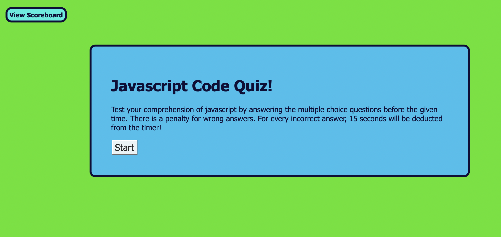

# Code-Quiz-Module-4

## Table of Contents
* [Projects Description](#projects-description)
* [Screenshots - Code examples](#screenshots---code-examples)
* [Technologies Used](#technologies-used)
* [Links](#links)

## Projects Description
In this project, the purpose was to create a coding quiz that tests a user's understanding of javascript. The application is a quiz that is timed with multiple choice questions. 

This application includes JavaScript, HTML and CSS. A few features included in this application are: a timer function that deducts time from the quiz due to incorrect answers, and displays the user's next question when an answer is submitted. Furthermore, it allows the user to save the highest score in the local storage and see them on a page that displays the history of all scores.

 
## Screenshots - Code examples
Screen shot of application


 
```js  
    var hasUpperCase = confirm("Do you want to include upper case letters?");
    var hasLowerCase = confirm("Do you want to include lower case letters?");
    var hasSpecialChar = confirm("Do you want include special characters?");
    var hasNumbers = confirm("Do you want to include numbers?");
 ```

## Technologies Used 


## Links
link to github: https://github.com/nfallis96
link to deployment: https://nfallis96.github.io/Password-Generator/